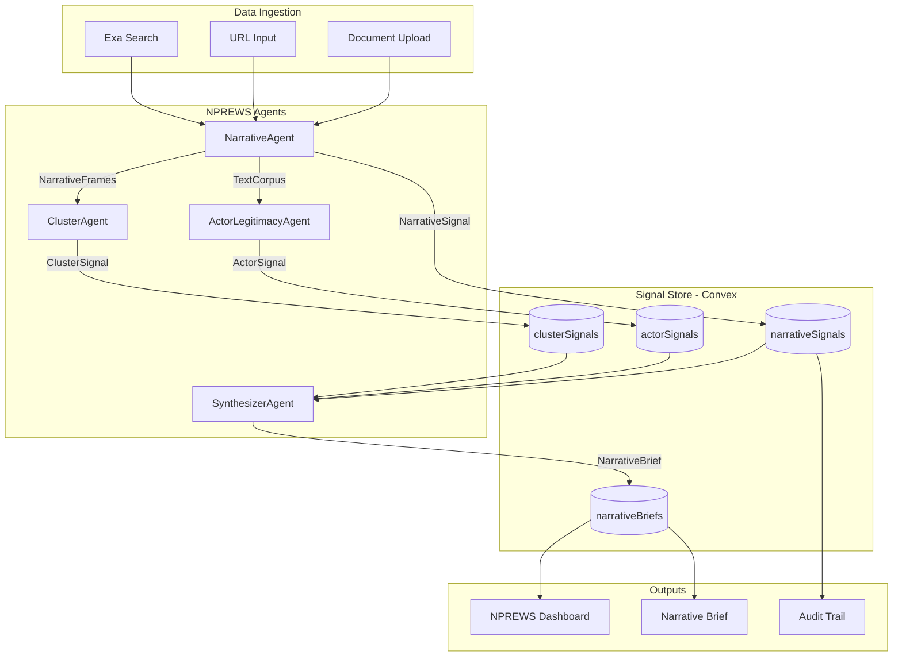

# NPREWS: Narrative & Policy Regime Early-Warning System

## Khazanah-Specific MVP (Agent-Native Architecture)

This builds modules 5.1, 5.2, and 5.3 from the NPREWS spec using **specialized agents** that detect uncertainty, argue with each other through hypotheses, and produce board-defensible signals.

---

## Agent Architecture



---

## Core Principle: Agents Share Hypotheses, Not Data

Agents **do not share raw text**. They share:

- **Hypotheses**: What they believe is happening
- **Evidence**: Why they believe it
- **Confidence**: How certain they are

### Example Agent Communication Flow

```
NarrativeAgent →
  "Energy pricing being reframed as welfare issue" (conf: 0.84)

ActorAgent →
  "Minister legitimised NGO-originated narrative" (conf: 0.91)

ClusterAgent →
  "This narrative clusters with 3 prior 'public good' frames" (conf: 0.78)

→ SynthesizerAgent →
  NarrativeBrief: "Policy risk elevated for energy sector holdings"
```

---

## Base Agent Interface

```typescript
// lib/agents/base.ts
export interface RiskAgent<I, O> {
  name: string;
  mandate: string;
  observe(input: I): Promise<O | null>;
}

export interface AgentSignal {
  id: string;
  agentName: string;
  hypothesis: string;
  confidence: number;
  evidence: Evidence[];
  createdAt: number;
}

export interface Evidence {
  source: string;
  quote: string;
  url?: string;
  sourceType: 'parliamentary' | 'regulatory' | 'media' | 'social';
}
```

---

## Agent 1: NarrativeAgent (Module 5.1)

**Mandate**: "Detect when public discourse shifts how an issue is framed."

### Agent Implementation

```typescript
// lib/agents/narrative-agent.ts
import { RiskAgent, AgentSignal, Evidence } from './base';
import { generateObject } from 'ai';
import { z } from 'zod';

type TextCorpus = {
  documents: Array<{
    text: string;
    source: string;
    url?: string;
    publishedAt?: string;
    sourceType: 'parliamentary' | 'regulatory' | 'media' | 'social';
  }>;
};

type NarrativeSignal = AgentSignal & {
  type: 'narrative';
  frame: string;
  frameType: 'emergence' | 'reframing' | 'responsibility' | 'solution';
  previousFrame?: string;
  sectors: string[];  // Khazanah sectors affected
};

export class NarrativeAgent implements RiskAgent<TextCorpus, NarrativeSignal[]> {
  name = 'NarrativeAgent';
  mandate = 'Detect when public discourse shifts how an issue is framed.';

  async observe(corpus: TextCorpus): Promise<NarrativeSignal[] | null> {
    const signals: NarrativeSignal[] = [];

    // Use LLM with structured output to detect narrative frames
    const result = await generateObject({
      model: provider.chat(modelConfig.model),
      prompt: this.buildPrompt(corpus),
      schema: NarrativeDetectionSchema,
    });

    for (const detection of result.object.narratives) {
      if (detection.confidence > 0.6) {
        signals.push({
          id: generateId(),
          agentName: this.name,
          type: 'narrative',
          hypothesis: `"${detection.frame}" narrative detected`,
          frame: detection.frame,
          frameType: detection.frameType,
          previousFrame: detection.previousFrame,
          sectors: detection.sectors,
          confidence: detection.confidence,
          evidence: detection.evidence,
          createdAt: Date.now(),
        });
      }
    }

    return signals.length > 0 ? signals : null;
  }

  private buildPrompt(corpus: TextCorpus): string {
    return `You are a narrative detection specialist for Khazanah Nasional.

Analyze the following documents and identify narrative frames being established.

DOCUMENTS:
${corpus.documents.map(d => `[${d.sourceType}] ${d.source}: "${d.text}"`).join('\n\n')}

DETECT:
1. Emergence: New issue frames appearing
2. Reframing: Existing issues being reframed
3. Responsibility: Blame/credit being assigned
4. Solution: Policy solutions being normalized

KHAZANAH SECTORS TO MAP:
energy, utilities, infrastructure, healthcare, telecommunications,
financial_services, technology, real_estate, aviation, media

For each narrative detected, provide:
- The frame (one sentence summary)
- Frame type
- Previous frame (if reframing)
- Affected Khazanah sectors
- Confidence (0-1)
- Evidence (exact quotes with sources)`;
  }
}

const NarrativeDetectionSchema = z.object({
  narratives: z.array(z.object({
    frame: z.string(),
    frameType: z.enum(['emergence', 'reframing', 'responsibility', 'solution']),
    previousFrame: z.string().optional(),
    sectors: z.array(z.string()),
    confidence: z.number().min(0).max(1),
    evidence: z.array(z.object({
      source: z.string(),
      quote: z.string(),
      sourceType: z.string(),
    })),
  })),
});
```

### Khazanah Sector Mapping

```typescript
// lib/agents/khazanah-sectors.ts
export const KHAZANAH_SECTORS = [
  'energy',
  'utilities', 
  'infrastructure',
  'healthcare',
  'telecommunications',
  'financial_services',
  'technology',
  'real_estate',
  'aviation',
  'media'
] as const;

export const SECTOR_KEYWORDS: Record<string, string[]> = {
  energy: ['energy', 'oil', 'gas', 'petroleum', 'fuel', 'power generation'],
  utilities: ['electricity', 'water', 'tariff', 'utility', 'TNB', 'Tenaga'],
  infrastructure: ['highway', 'rail', 'port', 'airport', 'construction'],
  healthcare: ['hospital', 'healthcare', 'medical', 'pharmaceutical'],
  telecommunications: ['telco', '5G', 'broadband', 'mobile', 'Celcom', 'Maxis'],
  financial_services: ['bank', 'insurance', 'fintech', 'lending'],
  technology: ['tech', 'digital', 'AI', 'data center', 'semiconductor'],
  real_estate: ['property', 'housing', 'development', 'REIT'],
  aviation: ['airline', 'airport', 'aviation', 'MAS', 'AirAsia'],
  media: ['media', 'broadcast', 'news', 'content'],
};
```

---

## Agent 2: ClusterAgent (Module 5.2 - Simple)

**Mandate**: "Group narratives by meaning to reveal coordinated messaging."

### Agent Implementation (Simple - No ML Libraries)

```typescript
// lib/agents/cluster-agent.ts
import { RiskAgent, AgentSignal } from './base';
import { embedMany, cosineSimilarity, generateObject } from 'ai';
import { z } from 'zod';

type NarrativeInput = {
  narratives: Array<{
  id: string;
    frame: string;
    frameType: string;
  }>;
};

type ClusterSignal = AgentSignal & {
  type: 'cluster';
  coreThesis: string;
  supportingArguments: string[];
  counterArguments: string[];
  moralFraming: string;
  narrativeIds: string[];
  clusterSize: number;
};

export class ClusterAgent implements RiskAgent<NarrativeInput, ClusterSignal[]> {
  name = 'ClusterAgent';
  mandate = 'Group narratives by meaning to reveal coordinated messaging.';

  private SIMILARITY_THRESHOLD = 0.75;

  async observe(input: NarrativeInput): Promise<ClusterSignal[] | null> {
    if (input.narratives.length < 2) return null;

  // 1. Generate embeddings for all narrative frames
  const { embeddings } = await embedMany({
    model: openai.embedding('text-embedding-3-small'),
      values: input.narratives.map(n => n.frame),
    });

    // 2. Simple threshold-based clustering
    const clusters: Array<{
      narrativeIds: string[];
      frames: string[];
      centroid: number[];
    }> = [];

    for (let i = 0; i < input.narratives.length; i++) {
    let assigned = false;
      
    for (const cluster of clusters) {
        const similarity = cosineSimilarity(embeddings[i], cluster.centroid);
        if (similarity > this.SIMILARITY_THRESHOLD) {
          cluster.narrativeIds.push(input.narratives[i].id);
          cluster.frames.push(input.narratives[i].frame);
        assigned = true;
        break;
      }
    }

    if (!assigned) {
      clusters.push({
          narrativeIds: [input.narratives[i].id],
          frames: [input.narratives[i].frame],
          centroid: embeddings[i],
        });
      }
    }

    // 3. Only emit signals for clusters with 2+ narratives
    const significantClusters = clusters.filter(c => c.narrativeIds.length >= 2);
    if (significantClusters.length === 0) return null;

    // 4. Use LLM to analyze each cluster
    const signals: ClusterSignal[] = [];

    for (const cluster of significantClusters) {
      const analysis = await generateObject({
        model: provider.chat(modelConfig.model),
        prompt: `Analyze this cluster of related narratives:
${cluster.frames.map((f, i) => `${i + 1}. "${f}"`).join('\n')}

Identify:
1. Core thesis (what they're all saying)
2. Supporting arguments used
3. Counter-arguments that exist
4. Moral framing (fairness, security, efficiency, etc.)`,
        schema: ClusterAnalysisSchema,
      });

      signals.push({
        id: generateId(),
        agentName: this.name,
        type: 'cluster',
        hypothesis: `${cluster.narrativeIds.length} narratives cluster around: "${analysis.object.coreThesis}"`,
        coreThesis: analysis.object.coreThesis,
        supportingArguments: analysis.object.supportingArguments,
        counterArguments: analysis.object.counterArguments,
        moralFraming: analysis.object.moralFraming,
        narrativeIds: cluster.narrativeIds,
        clusterSize: cluster.narrativeIds.length,
        confidence: Math.min(0.5 + (cluster.narrativeIds.length * 0.1), 0.95),
        evidence: cluster.frames.map(f => ({ source: 'Narrative', quote: f, sourceType: 'analysis' })),
        createdAt: Date.now(),
      });
    }

    return signals;
  }
}

const ClusterAnalysisSchema = z.object({
  coreThesis: z.string(),
  supportingArguments: z.array(z.string()),
  counterArguments: z.array(z.string()),
  moralFraming: z.string(),
});
```

### Why This Is Simple

- No scikit-learn, no k-means, no DBSCAN
- Just `embedMany` + `cosineSimilarity` (built into AI SDK)
- Threshold-based grouping (0.75 = semantically similar)
- LLM fills in the analysis fields

---

## Agent 3: ActorLegitimacyAgent (Module 5.3)

**Mandate**: "Identify who is speaking and whether institutional legitimacy is being transferred."

### Agent Implementation

```typescript
// lib/agents/actor-agent.ts
import { RiskAgent, AgentSignal, Evidence } from './base';
import { generateObject } from 'ai';
import { z } from 'zod';

type TextCorpus = {
  documents: Array<{
    text: string;
    source: string;
    url?: string;
    sourceType: 'parliamentary' | 'regulatory' | 'media' | 'social';
  }>;
  narrativeContext?: string;  // The narrative being tracked
};

type ActorSignal = AgentSignal & {
  type: 'actor';
  actors: ActorInfo[];
  legitimacyTransfer?: {
    from: string;
    to: string;
    narrative: string;
  };
};

type ActorInfo = {
  name: string;
  category: ActorCategory;
  role: 'originator' | 'amplifier' | 'legitimiser';
  legitimacyScore: number;
};

type ActorCategory = 
  | 'minister' | 'regulator' | 'mp' | 'central_bank'
  | 'ngo_major' | 'industry_body' | 'tier1_media' | 'academic' | 'analyst';

export class ActorLegitimacyAgent implements RiskAgent<TextCorpus, ActorSignal | null> {
  name = 'ActorLegitimacyAgent';
  mandate = 'Identify who is speaking and whether institutional legitimacy is being transferred.';

  // Khazanah-specific legitimacy weights
  private ACTOR_WEIGHTS: Record<ActorCategory, { authority: number; influence: number; credibility: number }> = {
  minister:      { authority: 95, influence: 90, credibility: 80 },
  regulator:     { authority: 90, influence: 85, credibility: 85 },
  central_bank:  { authority: 95, influence: 95, credibility: 90 },
  mp:            { authority: 70, influence: 60, credibility: 60 },
  ngo_major:     { authority: 50, influence: 65, credibility: 70 },
  industry_body: { authority: 60, influence: 70, credibility: 65 },
  tier1_media:   { authority: 40, influence: 75, credibility: 75 },
  academic:      { authority: 70, influence: 40, credibility: 85 },
  analyst:       { authority: 50, influence: 50, credibility: 60 },
};

  async observe(corpus: TextCorpus): Promise<ActorSignal | null> {
    // 1. Extract actors from documents
    const result = await generateObject({
      model: provider.chat(modelConfig.model),
      prompt: this.buildPrompt(corpus),
      schema: ActorExtractionSchema,
    });

    if (result.object.actors.length === 0) return null;

    // 2. Calculate legitimacy scores
    const actors: ActorInfo[] = result.object.actors.map(a => ({
      ...a,
      legitimacyScore: this.calculateLegitimacy(a.category),
    }));

    // 3. Detect legitimacy transfer (key signal!)
    const legitimacyTransfer = this.detectLegitimacyTransfer(actors, corpus.narrativeContext);

    // 4. Build hypothesis
    let hypothesis: string;
    let confidence: number;

    if (legitimacyTransfer) {
      hypothesis = `Legitimacy transfer detected: ${legitimacyTransfer.from} narrative adopted by ${legitimacyTransfer.to}`;
      confidence = 0.9;  // High confidence for legitimacy transfers
    } else {
      const legitimiser = actors.find(a => a.role === 'legitimiser');
      if (legitimiser) {
        hypothesis = `${legitimiser.name} (${legitimiser.category}) legitimising narrative`;
        confidence = 0.75;
      } else {
        hypothesis = `${actors.length} actors identified in narrative discourse`;
        confidence = 0.6;
      }
    }

    return {
      id: generateId(),
      agentName: this.name,
      type: 'actor',
      hypothesis,
      actors,
      legitimacyTransfer,
      confidence,
      evidence: result.object.actors.map(a => ({
        source: a.name,
        quote: a.quote || '',
        sourceType: 'analysis',
      })),
      createdAt: Date.now(),
    };
  }

  private calculateLegitimacy(category: ActorCategory): number {
    const weights = this.ACTOR_WEIGHTS[category];
    return Math.round((weights.authority + weights.influence + weights.credibility) / 3);
  }

  private detectLegitimacyTransfer(
    actors: ActorInfo[],
    narrativeContext?: string
  ): { from: string; to: string; narrative: string } | undefined {
    const originator = actors.find(a => a.role === 'originator');
    const legitimiser = actors.find(a => a.role === 'legitimiser');

    // Key signal: when a high-legitimacy actor adopts a low-legitimacy actor's narrative
    if (originator && legitimiser && legitimiser.legitimacyScore > originator.legitimacyScore + 20) {
      return {
        from: `${originator.name} (${originator.category})`,
        to: `${legitimiser.name} (${legitimiser.category})`,
        narrative: narrativeContext || 'Unknown narrative',
      };
    }
    return undefined;
  }

  private buildPrompt(corpus: TextCorpus): string {
    return `You are an actor legitimacy analyst for Khazanah Nasional.

Identify all actors (speakers, sources) in these documents and classify their role.

DOCUMENTS:
${corpus.documents.map(d => `[${d.sourceType}] ${d.source}: "${d.text}"`).join('\n\n')}

${corpus.narrativeContext ? `NARRATIVE CONTEXT: ${corpus.narrativeContext}` : ''}

ACTOR CATEGORIES:
- minister: Government ministers
- regulator: Regulatory bodies (SC, BNM, etc.)
- mp: Members of Parliament
- central_bank: Bank Negara Malaysia
- ngo_major: Major NGOs
- industry_body: Industry associations
- tier1_media: Major news outlets (Star, NST, etc.)
- academic: University researchers
- analyst: Financial/market analysts

ROLES:
- originator: First to articulate this narrative
- amplifier: Repeating/spreading the narrative
- legitimiser: Institutional figure validating it

For each actor, provide name, category, role, and a key quote.`;
  }
}

const ActorExtractionSchema = z.object({
  actors: z.array(z.object({
    name: z.string(),
    category: z.enum(['minister', 'regulator', 'mp', 'central_bank', 'ngo_major', 'industry_body', 'tier1_media', 'academic', 'analyst']),
    role: z.enum(['originator', 'amplifier', 'legitimiser']),
    quote: z.string().optional(),
  })),
});
```

### Key Signal: Legitimacy Transfer

When a **legitimiser** (minister, regulator) picks up an **originator's** (NGO, MP) narrative, that's a **regime shift signal**. This is the most important detection this agent performs.

---

## Agent 4: SynthesizerAgent (The Boss)

**Mandate**: "Decide whether signals warrant a Narrative Brief for human review."

### Agent Implementation

```typescript
// lib/agents/synthesizer-agent.ts
import { RiskAgent } from './base';
import { generateObject } from 'ai';
import { z } from 'zod';

type SignalInput = {
  narrativeSignals: NarrativeSignal[];
  actorSignals: ActorSignal[];
  clusterSignals: ClusterSignal[];
};

type NarrativeBrief = {
  id: string;
  title: string;
  summary: string;
  whyItMatters: string;
  sectors: string[];
  regimeBand: 'dormant' | 'emerging' | 'normalising' | 'pre_formal' | 'imminent';
  confidence: number;
  contributingSignals: string[];
  actors: ActorInfo[];
  evidence: Evidence[];
  recommendedAction: 'monitor' | 'review' | 'escalate';
  createdAt: number;
};

export class SynthesizerAgent implements RiskAgent<SignalInput, NarrativeBrief | null> {
  name = 'SynthesizerAgent';
  mandate = 'Decide whether signals warrant a Narrative Brief for human review.';

  async observe(input: SignalInput): Promise<NarrativeBrief | null> {
    const { narrativeSignals, actorSignals, clusterSignals } = input;

    // 1. Filter signals above confidence threshold
    const significantNarratives = narrativeSignals.filter(s => s.confidence > 0.7);
    const significantActors = actorSignals.filter(s => s.confidence > 0.7);
    const significantClusters = clusterSignals.filter(s => s.confidence > 0.6);

    // 2. Check for corroboration (multiple agents agreeing)
    const hasLegitimacyTransfer = significantActors.some(s => s.legitimacyTransfer);
    const hasReframing = significantNarratives.some(s => s.frameType === 'reframing');
    const hasClusterGrowth = significantClusters.some(s => s.clusterSize >= 3);

    // 3. Determine if brief is warranted
    const corroborationScore = 
      (hasLegitimacyTransfer ? 0.3 : 0) +
      (hasReframing ? 0.25 : 0) +
      (hasClusterGrowth ? 0.2 : 0) +
      (significantNarratives.length > 0 ? 0.15 : 0) +
      (significantActors.length > 0 ? 0.1 : 0);

    if (corroborationScore < 0.4) return null;  // Not enough signal

    // 4. Generate the brief using LLM
    const allEvidence = [
      ...significantNarratives.flatMap(s => s.evidence),
      ...significantActors.flatMap(s => s.evidence),
    ];

    const result = await generateObject({
      model: provider.chat(modelConfig.model),
      prompt: this.buildPrompt(significantNarratives, significantActors, significantClusters),
      schema: NarrativeBriefSchema,
    });

    // 5. Determine regime band
    const regimeBand = this.determineRegimeBand(corroborationScore, hasLegitimacyTransfer);

    // 6. Determine recommended action
    const recommendedAction = this.determineAction(regimeBand, hasLegitimacyTransfer);

    return {
      id: generateId(),
      title: result.object.title,
      summary: result.object.summary,
      whyItMatters: result.object.whyItMatters,
      sectors: [...new Set(significantNarratives.flatMap(s => s.sectors))],
      regimeBand,
      confidence: corroborationScore,
      contributingSignals: [
        ...significantNarratives.map(s => s.id),
        ...significantActors.map(s => s.id),
        ...significantClusters.map(s => s.id),
      ],
      actors: significantActors.flatMap(s => s.actors),
      evidence: allEvidence.slice(0, 10),  // Top 10 evidence items
      recommendedAction,
      createdAt: Date.now(),
    };
  }

  private determineRegimeBand(
    score: number,
    hasLegitimacyTransfer: boolean
  ): NarrativeBrief['regimeBand'] {
    if (hasLegitimacyTransfer && score > 0.7) return 'pre_formal';
    if (score > 0.8) return 'normalising';
    if (score > 0.6) return 'emerging';
    return 'dormant';
  }

  private determineAction(
    band: NarrativeBrief['regimeBand'],
    hasLegitimacyTransfer: boolean
  ): NarrativeBrief['recommendedAction'] {
    if (band === 'pre_formal' || band === 'imminent') return 'escalate';
    if (band === 'normalising' || hasLegitimacyTransfer) return 'review';
    return 'monitor';
  }

  private buildPrompt(
    narratives: NarrativeSignal[],
    actors: ActorSignal[],
    clusters: ClusterSignal[]
  ): string {
    return `You are generating a Narrative Brief for Khazanah risk leadership.

DETECTED SIGNALS:

NARRATIVES:
${narratives.map(n => `- ${n.hypothesis} (${n.frameType}, conf: ${n.confidence})`).join('\n')}

ACTORS:
${actors.map(a => `- ${a.hypothesis} (conf: ${a.confidence})`).join('\n')}

CLUSTERS:
${clusters.map(c => `- ${c.hypothesis} (size: ${c.clusterSize})`).join('\n')}

Generate a board-appropriate brief with:
1. Title: Clear, neutral headline
2. Summary: 2-3 sentences on what's happening
3. Why It Matters: Khazanah-specific implications

Language must be:
- Neutral and non-alarmist
- Decision-supportive
- Documentable`;
  }
}

const NarrativeBriefSchema = z.object({
  title: z.string(),
  summary: z.string(),
  whyItMatters: z.string(),
});
```

### Regime Bands (From NPREWS Spec)

| Band | Definition | Action |

|------|------------|--------|

| Dormant | Narrative exists but inactive | Monitor |

| Emerging | Growing mentions, limited actors | Monitor |

| Normalising | Multiple actors, consistent framing | Review |

| Pre-formal | Legitimisers engaged, policy language | Escalate |

| Imminent | Formal policy drafting underway | Escalate |

---

## Agent Orchestration

```typescript
// lib/agents/orchestrator.ts
import { NarrativeAgent } from './narrative-agent';
import { ActorLegitimacyAgent } from './actor-agent';
import { ClusterAgent } from './cluster-agent';
import { SynthesizerAgent } from './synthesizer-agent';

export class NPREWSOrchestrator {
  private narrativeAgent = new NarrativeAgent();
  private actorAgent = new ActorLegitimacyAgent();
  private clusterAgent = new ClusterAgent();
  private synthesizer = new SynthesizerAgent();

  async analyze(documents: TextCorpus): Promise<{
    signals: AgentSignal[];
    brief: NarrativeBrief | null;
  }> {
    // 1. Run NarrativeAgent first
    const narrativeSignals = await this.narrativeAgent.observe(documents) || [];

    // 2. Run ActorAgent with narrative context
    const actorSignals: ActorSignal[] = [];
    for (const narrative of narrativeSignals) {
      const actorSignal = await this.actorAgent.observe({
        documents: documents.documents,
        narrativeContext: narrative.frame,
      });
      if (actorSignal) actorSignals.push(actorSignal);
    }

    // 3. Run ClusterAgent on detected narratives
    const clusterSignals = await this.clusterAgent.observe({
      narratives: narrativeSignals.map(n => ({
        id: n.id,
        frame: n.frame,
        frameType: n.frameType,
      })),
    }) || [];

    // 4. Run Synthesizer to judge if brief is warranted
    const brief = await this.synthesizer.observe({
      narrativeSignals,
      actorSignals,
      clusterSignals,
    });

    return {
      signals: [...narrativeSignals, ...actorSignals, ...clusterSignals],
      brief,
    };
  }
}
```

---

## Convex Schema

```typescript
// convex/schema.ts additions
narratives: defineTable({
  frame: v.string(),
  frameType: v.union(
    v.literal('emergence'),
    v.literal('reframing'),
    v.literal('responsibility'),
    v.literal('solution')
  ),
  previousFrame: v.optional(v.string()),
  actors: v.array(v.string()),
  evidence: v.array(v.object({
    source: v.string(),
    quote: v.string(),
    url: v.optional(v.string()),
    publishedAt: v.optional(v.string()),
    sourceType: v.string(),
  })),
  sectors: v.array(v.string()),      // Khazanah sectors affected
  confidence: v.number(),
  clusterId: v.optional(v.id('clusters')),
  detectedAt: v.number(),
  reviewedBy: v.optional(v.string()), // Human-in-the-loop
  reviewedAt: v.optional(v.number()),
}).index('by_sector', ['sectors'])
  .index('by_cluster', ['clusterId']),

clusters: defineTable({
  coreThesis: v.string(),
  supportingArguments: v.array(v.string()),
  counterArguments: v.array(v.string()),
  moralFraming: v.string(),
  centroidEmbedding: v.array(v.number()),
  narrativeCount: v.number(),
  createdAt: v.number(),
  updatedAt: v.number(),
}),

actors: defineTable({
  name: v.string(),
  category: v.string(),
  role: v.string(),
  legitimacyScore: v.number(),
  institutionalAuthority: v.number(),
  policyInfluence: v.number(),
  mediaCredibility: v.number(),
  narrativeIds: v.array(v.id('narratives')),
  firstSeenAt: v.number(),
  lastSeenAt: v.number(),
}).index('by_category', ['category'])
  .index('by_legitimacy', ['legitimacyScore']),

auditLog: defineTable({
  action: v.string(),               // 'narrative_detected', 'cluster_created', 'human_review'
  entityType: v.string(),           // 'narrative', 'cluster', 'actor'
  entityId: v.string(),
  details: v.any(),
  userId: v.optional(v.string()),
  timestamp: v.number(),
}),
```

---

## UI: Narrative Brief View

### Main Dashboard (`/nprews`)

```
┌─────────────────────────────────────────────────────────────┐
│  NPREWS - Narrative Early Warning                           │
│  Khazanah Risk Intelligence                                 │
├─────────────────────────────────────────────────────────────┤
│                                                             │
│  ACTIVE NARRATIVES                              3 this week │
│                                                             │
│  ┌─────────────────────────────────────────────────────┐   │
│  │ REFRAMING                                           │   │
│  │ "Energy pricing framed as public welfare issue      │   │
│  │  rather than market efficiency"                     │   │
│  │                                                     │   │
│  │ Sectors: Energy, Utilities                          │   │
│  │ Key Actors: Minister of Energy (Legitimiser)        │   │
│  │ Confidence: 84%                                     │   │
│  │                                                     │   │
│  │ [View Brief] [Mark Reviewed]                        │   │
│  └─────────────────────────────────────────────────────┘   │
│                                                             │
│  ACTOR ESCALATION                                           │
│  ┌─────────────────────────────────────────────────────┐   │
│  │ Minister of Finance amplified narrative originally  │   │
│  │ from NGO "Citizens for Fair Energy"                 │   │
│  │ Legitimacy upgrade: NGO → Ministerial               │   │
│  └─────────────────────────────────────────────────────┘   │
│                                                             │
└─────────────────────────────────────────────────────────────┘
```

### Narrative Brief Detail (`/nprews/[id]`)

```
┌─────────────────────────────────────────────────────────────┐
│  ← Back                                    [Export PDF]     │
├─────────────────────────────────────────────────────────────┤
│                                                             │
│  NARRATIVE BRIEF                                            │
│  ━━━━━━━━━━━━━━━━━━━━━━━━━━━━━━━━━━━━━                      │
│                                                             │
│  Frame: Energy pricing as public welfare issue              │
│  Type: REFRAMING (was: market efficiency)                   │
│  Detected: Jan 13, 2026                                     │
│                                                             │
│  ─────────────────────────────────────────────────────────  │
│  KHAZANAH EXPOSURE                                          │
│  ─────────────────────────────────────────────────────────  │
│  • Tenaga Nasional (Energy) - HIGH                          │
│  • Petronas Gas (Utilities) - MEDIUM                        │
│                                                             │
│  ─────────────────────────────────────────────────────────  │
│  KEY ACTORS                                                 │
│  ─────────────────────────────────────────────────────────  │
│  │ Actor              │ Role        │ Legitimacy │         │
│  │ Minister of Energy │ Legitimiser │ 92         │         │
│  │ MP (Opposition)    │ Originator  │ 65         │         │
│  │ The Star           │ Amplifier   │ 72         │         │
│                                                             │
│  ─────────────────────────────────────────────────────────  │
│  EVIDENCE                                                   │
│  ─────────────────────────────────────────────────────────  │
│  1. "We must ensure energy remains affordable for all       │
│      Malaysians, not just profitable for corporations"      │
│      — Minister of Energy, Parliamentary Session, Jan 10    │
│                                                             │
│  2. "The government has a duty to protect consumers..."     │
│      — The Star Editorial, Jan 11                           │
│                                                             │
│  ─────────────────────────────────────────────────────────  │
│  AUDIT TRAIL                                                │
│  ─────────────────────────────────────────────────────────  │
│  • Detected: Jan 13, 2026 09:42 AM                          │
│  • Source: Parliamentary Hansard via Exa                    │
│  • Flagged because: Minister (high legitimacy) adopted      │
│    opposition framing                                       │
│  • Status: PENDING REVIEW                                   │
│                                                             │
│              [Approve] [Dismiss] [Request More Context]     │
│                                                             │
└─────────────────────────────────────────────────────────────┘
```

---

## Files to Create

### Agent Infrastructure

- [`lib/agents/base.ts`](lib/agents/base.ts) - Base RiskAgent interface and types
- [`lib/agents/types.ts`](lib/agents/types.ts) - All signal type definitions
- [`lib/agents/khazanah-sectors.ts`](lib/agents/khazanah-sectors.ts) - Sector mapping

### Agents

- [`lib/agents/narrative-agent.ts`](lib/agents/narrative-agent.ts) - NarrativeAgent (5.1)
- [`lib/agents/actor-agent.ts`](lib/agents/actor-agent.ts) - ActorLegitimacyAgent (5.3)
- [`lib/agents/cluster-agent.ts`](lib/agents/cluster-agent.ts) - ClusterAgent (5.2)
- [`lib/agents/synthesizer-agent.ts`](lib/agents/synthesizer-agent.ts) - SynthesizerAgent
- [`lib/agents/orchestrator.ts`](lib/agents/orchestrator.ts) - Agent orchestration

### Convex

- [`convex/schema.ts`](convex/schema.ts) - Add signals, briefs, auditLog tables
- [`convex/signals.ts`](convex/signals.ts) - Signal CRUD operations
- [`convex/briefs.ts`](convex/briefs.ts) - Narrative brief operations
- [`convex/auditLog.ts`](convex/auditLog.ts) - Audit trail

### API

- [`app/api/nprews/analyze/route.ts`](app/api/nprews/analyze/route.ts) - Analysis endpoint (orchestrates agents)

### UI

- [`app/nprews/page.tsx`](app/nprews/page.tsx) - Main dashboard
- [`app/nprews/[id]/page.tsx`](app/nprews/[id]/page.tsx) - Narrative brief detail
- [`app/nprews/layout.tsx`](app/nprews/layout.tsx) - Layout with sidebar
- [`components/nprews/brief-card.tsx`](components/nprews/brief-card.tsx) - Brief card component
- [`components/nprews/signal-list.tsx`](components/nprews/signal-list.tsx) - Agent signals display
- [`components/nprews/actor-table.tsx`](components/nprews/actor-table.tsx) - Actor legitimacy table
- [`components/nprews/evidence-list.tsx`](components/nprews/evidence-list.tsx) - Evidence with sources
- [`components/nprews/regime-band.tsx`](components/nprews/regime-band.tsx) - Regime band indicator
- [`components/nprews/agent-contribution.tsx`](components/nprews/agent-contribution.tsx) - Which agents contributed

---

## Build Order

**Phase 1: Agent Foundation**

1. Base agent interface and types
2. Khazanah sector mapping
3. Convex schema for signals and briefs

**Phase 2: Core Agents (5.1 & 5.3 First)**

4. NarrativeAgent (5.1) - Frame detection
5. ActorLegitimacyAgent (5.3) - Actor mapping

**Phase 3: Clustering & Synthesis**

6. ClusterAgent (5.2) - Simple embedding clustering
7. SynthesizerAgent - Brief generation
8. Orchestrator - Agent coordination

**Phase 4: API & UI**

9. Analysis API endpoint
10. NPREWS Dashboard
11. Narrative Brief detail view